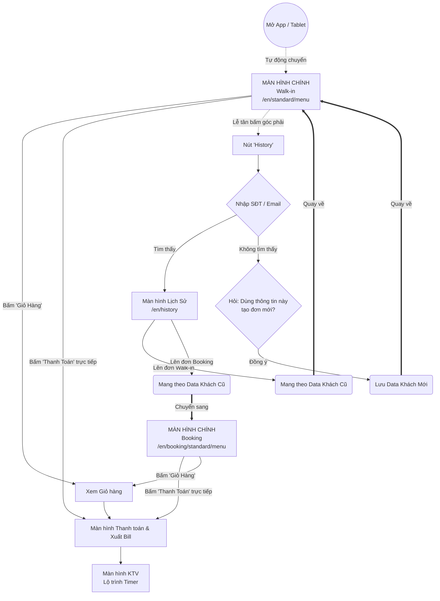

# Sơ đồ khối Hành trình Khách Hàng (Customer Flow) - BẢN THỰC TẾ (Cập nhật)

Dựa trên luồng gộp mới nhất, loại bỏ hoàn toàn sự phân tách `old-user`/`new-user`. Tất cả quy về một Menu Standard chung, có hỗ trợ thanh toán nhanh và xử lý thông minh khi tìm khách không thấy.

